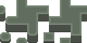
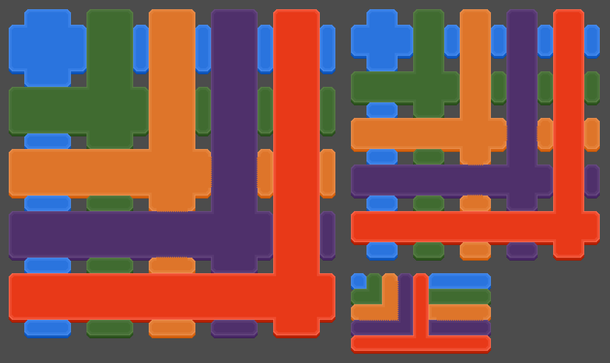

# A DualGrid Tilemap System Supporting Unlimited Adjacent Terrains
Adds a new "`DualGrid`" node (which extends `TileMapLayer`) to create a dual-grid tiling system for Godot which supports all mixes of adjacent terrains while still only requiring 28 unique tiles per terrain — **without requiring unique art for each bespoke mix**.

Bespoke mixes can be optionally added for any combination of two terrains. In the example project, this is configured for the Purple terrain mixing with the Orange terrain.

This allows the following terrain sets to combine and create a world of endless terrain possibilities.

## Key Advantages Over Other Dual Grid Systems

Other Dual Grid implementations either require each unique terrain to sit on their own layer, require bespoke mixes for every unique combination of terrain, or achieve their visuals through complicated logic that's difficult to extend or directly interact with. This implmentation aims to fix these problems, and offers the following key advantages:

- Supports unlimited terrain combinations while only requiring 28 unique tiles per terrain.
- Supports unlimited bespoke terrain combinations to override the default generic mix tiles.
- Easily supports overlaid tile art (See example project usage).
- The DualGrid's properties are passed through to the dynamically created children TileMapLayers that serve as the display layers, so they are still easily accessible.
- Particularly useful for sandbox games that need to support large number of terrains potentially appearing next to each other.

## Example Project

This repository contains an example Godot 4.4 project [in /example/](/example/) with seven terrains (and one bespoke mix) already configured using the addon.

The example shows using the `LayerOrderOverrideRule` to create an exception to fix the example project's specific art.

The example also shows two configured `BespokeMixRule`s which set up the Purple terrain mixing with the Orange and Red terrains.

## Installation

Install the plugin by adding `addons/dualgrid` to your Godot Project, then in **Project Settings > Plugins**, enable DualGrid.

## Basic Usage

Configure your `DualGridTileSet` just as you would configure a normal TileSet, and adjust its variables according to your art. See **Configuring Terrains** to setup any bespoke mixes.

For tiles that should not need to actually overlap with each other, no `LayerOrderOverrideRule`s should be required. If your tiles might overlap with each other, for example, to create the illusion of depth or walls, you may need to create one or more `LayerOrderOverrideRule` depending on your specific art. You can see examples of a `LayerOrderOverrideRule` configuration [in the example scene](example/example.tscn).

_NOTE: `LayerOrderOverrideRule`s can be very confusing to configure without visuals. I recommend adding your art and placing a few different tiles next to each other in the `DualGrid` so you can visually identify cases where your art is ordered incorrectly, similar to the example project scene. Use the **Live Ordering Update Preview** to see your masking changes affect the DualGrid in real time. For large DualGrids, toggle **Live Ordering Update Preview** to off/false and use the **Refresh Display Layer Preview**, as each change recalculates the display tiles for the entire DualGrid._

If your tiles extend in the opposite direction as the example artwork, **Reverse Default Layering Order** can be used to flip the ordering.

To use physics layers from the Display Tiles, set **Display Collision Enabled** to true.

### Configuring Terrains

1. Create your terrain within the `DualGridTileSet` resource. At minimum, add the required 28 tiles (0,3 in each terrain can be blank, this is used as an "alias" for use in the `DualGrid` directly in the example project. Placing any tile from the terrain in the DualGrid qualifies for that tile occupying that world tile). Each base `TileType` should be its own texture.
2.  If you've created any bespoke mixes, create `BespokeMixRule` where the **Primary Source ID** is set to its source id, and the **Secondary Source ID** is set to the terrain that set of tiles is mixing with. Finally, specify the **Atlas Offset** which references the offset for this mix set in the **Primary Source ID** terrain.  (In the example project, in the Purple `TileType`, the Orange mix is offset by 8 and the Red mix is offset by 12). These are not required!

## Upgrading from Version 1 to Version 2

If you've already integrated version 1, here are some instructions to get your implementation updated to version 2. If this is your first time installing DualGrid, just follow **Basic Usage** and **Configuring Terrains**.

1. Install and enable the new DualGrid addon, according to **Installation**. 
2. Rename `class_name DualGrid` from the old `dualgrid.gd` in your project to `DualGridOld` to prevent a class_name conflict. Update any references to `DualGrid` in your project to `DualGridOld`. This preserves existing functionality while you work through updating your integration.
2. Convert your `TileSet` resource to a `DualGridTileSet` resource. 
3. In your `DualGridTileSet`, transmute your `tile_mix_map` configurations into `BespokeMixRule`(s).
4. If you previously made any specific adjustments for edge cases similar to the example project, instead of editing the addon directly, configuring `LayerOrderOverrideRule`(s) for the `DualGrid` should be sufficient.
5. Replace your previous `DualGridOld` with new `DualGrid` nodes (now from the addon.)
6. Update any code using `set_cell` on the old DualGrid to `set_world_tile`.

## Contributing

I was inspired to create and post this project under the MIT license because of the dedicated and amazing Godot Community. I intend on using this system for several of my own projects, so I will be actively maintaining this repository for the forseeable future. I welcome any contributions from the community!

## License and Required Disclosures

### License
This project is released under the [MIT License](LICENSE)

### References
This project would not have been possible without other developers who created their own Dual Grid implementations and shared that code openly. They were a huge inspiration for this project!

- [Dual Grid Tilemap System for Godot in GDScript by GlitchedinOrbit](https://github.com/GlitchedinOrbit/dual-grid-tilemap-system-godot-gdscript)
- [Dual Grid Tilemap System in Godot by jess-hammer](https://github.com/jess-hammer/dual-grid-tilemap-system-godot)
- [TileMapDual by pablogila](https://github.com/pablogila/TileMapDual) - Isometric or Hex tile support.
- [Jess::codes's "Draw fewer tiles - by using a Dual-Grid system" Video](https://www.youtube.com/watch?v=jEWFSv3ivTg)
- [This particular feature proposal comment in TileMapDual by megonemad1](https://github.com/pablogila/TileMapDual/issues/32)

## Credits

- [Exonfang](https://github.com/Exonfang) contributed the original DualGrid implementation.
- [Jesse-Goertzen](https://github.com/Jesse-Goertzen) contributed a significant refactor of the original DualGrid implementation into a proper addon, adding `BespokeMixRule` and `LayerOrderOrverrideRule`, and editor preview functionality.
