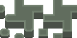
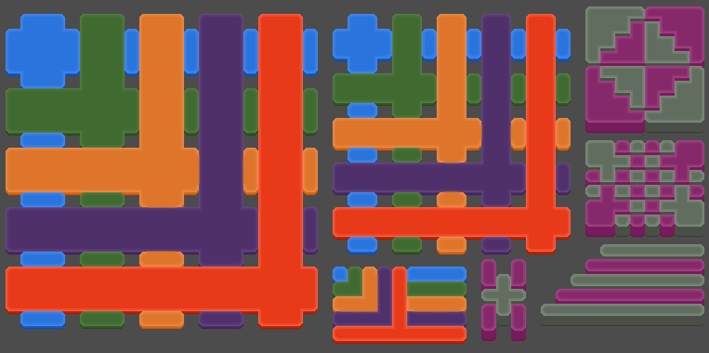

# A DualGrid Tilemap System Supporting Unlimited Adjacent Terrains
Adds a new "`DualGrid`" node (which extends `TileMapLayer`) to create a dual-grid tiling system for Godot which supports all mixes of adjacent terrains while still only requiring 28 unique tiles per terrain — **without requiring unique art for each bespoke mix**.

Bespoke mixes can be optionally added for any combination of two terrains. In the example project, this is configured for the Purple terrain mixing with the Orange terrain.

This allows the following terrain sets to combine and create a world of endless terrain possibilities.







## Key Advantages Over Other Dual Grid Systems

Other Dual Grid implementations either require each unique terrain to sit on their own layer, require bespoke mixes for every unique combination of terrain, or achieve their visuals through complicated logic that's difficult to extend or directly interact with. This implmentation aims to fix these problems, and offers the following key advantages:

- Supports unlimited terrain combinations while only requiring 28 unique tiles per terrain.
- Supports unlimited bespoke terrain combinations to override the default generic mix tiles.
- Easily supports overlaid tile art (See example project usage).
- The display layers are default `TileMapLayer` nodes, which makes them easy to work with using Godot's existing toolset. No shader magic!
- Particularly useful for sandbox games that need to support large number of terrains potentially appearing next to each other.

## Example Project

This repository contains an example Godot 4.4 project [in /example/](/example/) with seven terrains (and one bespoke mix) already configured in the new DualGrid custom class.

_**Important Note:** The example project modifies the default implementation to allow proper layering specific to the tile art. These modifications might be useful to review if your tile art might overlap, as you see in the example image._

## Basic Usage

For tiles that should not need to actually overlap with each other, the default implementation ([in dualgrid.gd](dualgrid.gd)) should be sufficient. If your tiles might overlap with each other, for example, to create the illusion of depth or walls, some adjustments will need to be made to properly order each mix layer as needed for your project. You can see examples of these adjustments [in the example project's dualgrid.gd](example/dualgrid.gd).

For the most basic usage in your own project you need only copy [dualgrid.gd](dualgrid.gd) into your project, then follow the steps in [Setup](#setup) and [Configuring Terrains](#configuring-terrains) for each of your terrains.

### Setup

The `DualGrid` node expects four associated `TileMapLayer` nodes to use as the display layers. It also expects all five nodes (the `DualGrid` node and the four `TileMapLayer` nodes) share the same Tile Set resource.

1. Add a `DualGrid` node, and four `TileMapLayer` nodes in your scene. Configure all five of these nodes to use the same Tile Set resource.
2. Offset the position of each mix layer by negative one half of the tilesize. For example, if you have 16x16 tiles, the transform property for each mix layer should be set to (-8, -8).
3. Associate each `TileMapLayer` node to the `DualGrid` via the `@export mix_layer_1` through `@export mix_layer_4` variables (1-4) in the `DualGrid` node.

You will need to configure at least one terrain (and its associated `TileType`) and paint tiles from that terrain into the `DualGrid` node, then run the scene in order for the four `TileMapLayer` display layers to be built.

### Configuring Terrains

1. Add the new terrain to the Tile Set resource and add the required 28 tiles (0,3 in each terrain can be blank, this is used as an "alias" for use in the `DualGrid` directly in the example project). Each base `TileType` should be its own texture.
2. Update the `enum TileType` with your new constant to represent the new terrain. (Note, `TileType.NONE` is required, but you can remove the other example `TileType`s.)
```
enum TileType { NONE, YOUR_NEW_TILE }
```
3. In the `tiletype_to_source_id` dictionary, add a new entry referencing the new `TileType` you created and its Atlas ID found within the Tile Set. (Note, `TileType.NONE: -1` is required, but you can remove the other example TileTypes.)
```
var tiletype_to_source_id: Dictionary[TileType, int] = {
	TileType.NONE: -1,
	TileType.YOUR_NEW_TILE: 0,
}
```
4.  If you've created any bespoke mixes, create a new dictionary referencing the mixed `TileType` and its x offset within the terrain. (In the example project, in the Purple `TileType`, the Orange mix is offset by 8.). These are not required.
```
var your_new_tile_mix_map: Dictionary[TileType, int] = {
	TileType.MIXED_TILE: 8
}
```
5. Add a reference to the new mix dictionary in `tiletype_to_bespoke_mix`.
```
var tiletype_to_bespoke_mix: Dictionary[TileType, Dictionary] = {
	TileType.YOUR_NEW_TILE: your_new_tile_mix_map
}
```

## Contributing

I was inspired to create and post this project under the MIT license because of the dedicated and amazing Godot Community. I intend on using this system for several of my own projects, so I will be actively maintaining this repository for the forseeable future. I welcome any contributions from the community, in particular:

- Support for real time updates of the display layers in editor. (Other implementations have this, so it may be the case of cherry-picking some of that code, but it's not needed for my projects so isn't something I'm focused on currently.)
- Functions to transmute cursor coordinates to world or display coordinates. (I'll likely add these at some point in the near future, but if you get to it before me, a PR would be appreciated!)

**Important Note:** Do not contribute PRs for isometric or hex tiles — there are already better implementations for those (see [TileMapDual by pablogila](https://github.com/pablogila/TileMapDual)).

## License and Required Disclosures

### License
This project is released under the [MIT License](LICENSE)

### References
Other developers have great Dual Grid implementations, especially if you need editor support, or Isometric or Hex tile support. I highly recommend reviewing their projects in case their implementations might be a better fit for your project. They were also huge inspirations for this project!

- [Dual Grid Tilemap System for Godot in GDScript by GlitchedinOrbit](https://github.com/GlitchedinOrbit/dual-grid-tilemap-system-godot-gdscript)
- [Dual Grid Tilemap System in Godot by jess-hammer](https://github.com/jess-hammer/dual-grid-tilemap-system-godot)
- [TileMapDual by pablogila](https://github.com/pablogila/TileMapDual)
- [Jess::codes's "Draw fewer tiles - by using a Dual-Grid system" Video](https://www.youtube.com/watch?v=jEWFSv3ivTg)
- [This particular feature proposal comment in TileMapDual by megonemad1](https://github.com/pablogila/TileMapDual/issues/32)
